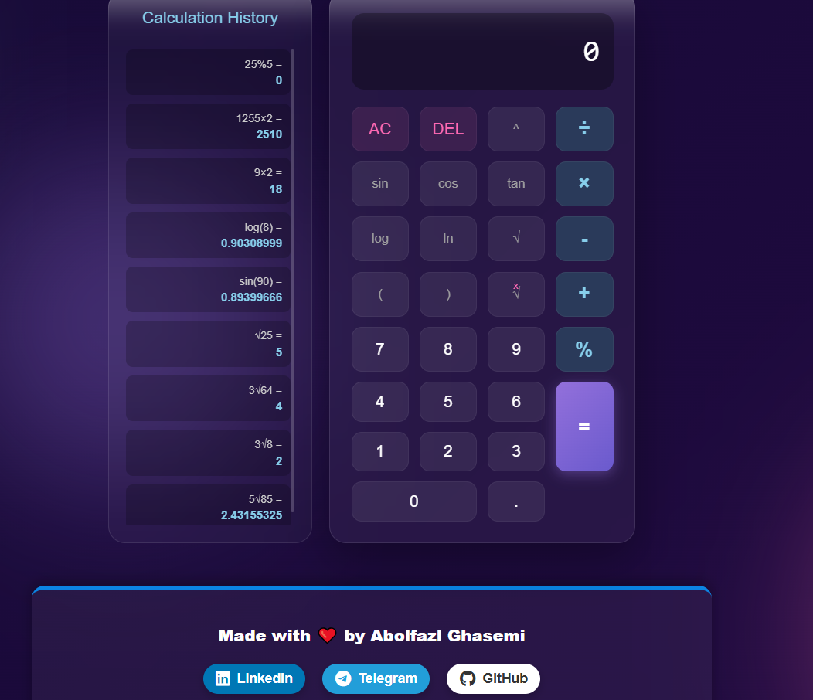

# 🚀 Advanced Scientific Calculator

An advanced scientific calculator web application built with HTML, CSS, and vanilla JavaScript. Features a modern, dark glassmorphism design, real-time calculation history, and comprehensive scientific functions, including support for $N$-th roots.

## 📸 Project Screenshot



## ✨ Features

* **Modern Design:** Sleek, Dark Mode, glassmorphism interface.
* **Scientific Functions:** Supports `sin`, `cos`, `tan`, `log`, `ln`, power (`^`), and percentage (`%`).
* **N-th Root Calculation:** Correctly calculates $N$-th roots (e.g., $3\sqrt{8}$).
* **History Panel:** Stores and displays calculation history, allowing users to reuse past results.
* **Responsiveness:** Fully functional and visually appealing on various screen sizes (desktops and mobile).
* **Error Handling:** Includes checks for syntax errors and division by zero.

## 🛠️ Technology Stack

* **HTML5:** Structure
* **CSS3:** Styling (with advanced gradients and `backdrop-filter` for glass effect)
* **JavaScript (ES6):** Core calculation logic and DOM manipulation

## ⚙️ How to Use

1.  **Clone the repository:**
    ```bash
    git clone https://github.com/abolfazlghasemi83/Calculator.git
    ```
2.  **Open the file:** Simply open the `index.html` file in any modern web browser.
3.  **Start Calculating:**
    * **Square Root:** Press `√` followed by the number/expression.
    * **N-th Root (e.g., Cube Root):** Type the index (e.g., `3`), then press the $x\sqrt{}$ button (which displays `3√`), followed by the radicand (e.g., `8`).
    * **Functions:** Functions like `sin` automatically add an opening parenthesis: `sin(`. Remember to close the parenthesis or let the calculator auto-correct it upon pressing `=`.

## 🔗 Connect

* **Developed by:** Abolfazl Ghasemi
* **LinkedIn:** [https://www.linkedin.com/in/abolfazl-ghasemi55/](https://www.linkedin.com/in/abolfazl-ghasemi55/)
* **GitHub:** [https://github.com/abolfazlghasemi83](https://github.com/abolfazlghasemi83)

## 📜 License

This project is licensed under the MIT License. See the [LICENSE](LICENSE) file for details.
